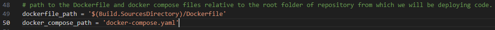
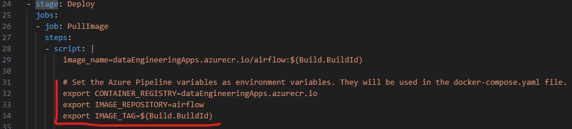
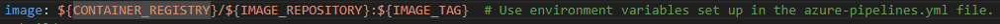
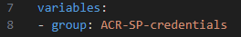
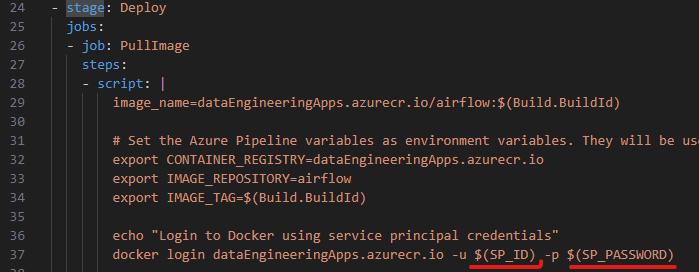
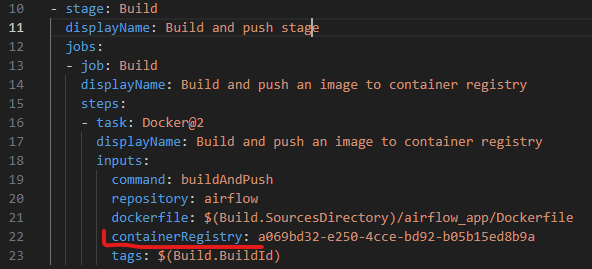

# Intro
This is a code for automatic management of resources in Azure DevOps and generating a proper YAML file which are needed to create a CI/CD pipeline for deploying applications. For example, those created resources and YAML file can be used for creating a CI/CD pipeline for deploying applications containerized using Docker onto an Azure Linux VM.

# Setting up an Agent pool
For building any CI/CD pipeline we need an Agent pool where we will be adding agents. Agents are installed on a computer and they performs actions defined in the CI/CD pipeline.

In order to create an Agent pool we can use the ci_cd_setup > agent_pool_setup > setup.py script. In that script we need to specify a name of the Agent pool which we will create.

Before running this script we need to create the .env file in the ci_cd_setup > agent_pool_setup folder and assign there DevOps access token to the 'AZURE_DEVOPS_PAT' variable just like it is shown in the .env-draft file.

# Setting up resources for a CI/CD pipeline - ACR push and pull
Here we are gonna explain how to use this code in order to set up resources in Azure DevOps and generate a YAML file needed to create a CI/CD pipeline which will be building a Docker image from code in repository, pushing it to the Azure Container Registry (ACR) and then pulling it onto Azure Linux VM and running it. 

This code is not building the CI/CD pipeline itself. It needs to be created additionally using the YAML file and DevOps resources created by this code.

## Setting up DevOps resources and generating a YAML file
The ci_cd_setup > acr_push_and_pull > setup.py script is performing the following actions:

1. **Add Service Principal credentials to the Variable group in DevOps Library:**\
They are used in the YAML file in order to pull an image from ACR. We will create a variable group with a specified name and create there variables SP_ID and SP_PASSWORD for application ID and password of the Service Principal we mentioned in the code prerequisites.

2. **Create a Service connection in DevOps linked to the ACR:**\
We will use that Service connection in order to push a Docker image to ACR. We will use the ID of that Service Connection in the YAML file for the containerRegistry argument in the step for pushing image to ACR.

3. **Generate the YAML file:**\
We will generate the YAML file defining actions to perform in our CI/CD pipeline. It will need to be added to the repo containing the Docker image which we want to deploy onto VM. The script will add to this file a proper information about:
    - Created Variable group in DevOps Library
    - ID of the created Service connection linked to the ACR
    - Name of the Agent pool to use
    - Name of the ACR which will be used

Once we have those resources in DevOps created and YAML file generated, we can move this YAML file to the repository we want to deploy and create a CI/CD pipeline. 

## Code prerequisites
Before running the ci_cd_setup > acr_push_and_pull > setup.py script we need to prepare:
- **Agent pool** - name of this pool is used by the code to generate the proper YAML file. We don't need to have any Agents there in order to run this code. Pool can be created using the ci_cd_setup > agent_pool_setup > setup.py script as described in the previous section 'Setting up an Agent pool' in this documentation.
- **Azure Container Registry and Service Principal** - we will be pushing our Docker images to ACR and pulling them from it. We need to have a Service Principal with the 'acrpush' role and scope for that ACR which will be used for authentication when pushing and pulling images. Both ACR and Service Principal can be created using the 'create_acr' module from the 'azure_terraform' repository.
- **setup.py script configuration** - In the ci_cd_setup > acr_push_and_pull > setup.py script, at the beginning in the 'Script configuration' section we need to provide proper values for variables. They are described in the script.
- **.env file configuration** - Before running this script we need to additionally create the .env file in the ci_cd_setup > acr_push_and_pull folder and add there a few environment variables:

    -- devops organization and project names can be taken from url: dev.azure.com/{organization}/{project} --\
    DEVOPS_ORGANIZATION = "your_organizaiton"\
    DEVOPS_PROJECT = "your_project"\
    -- personal access token to DevOps. It can be generated on the website. --\
    AZURE_DEVOPS_PAT = "your_token"\
    -- subscription ID --\
    SUB_ID = "your_sub_id"\
    -- Below are the credentials for Service Principal which has 'acrpush' role and scope for the ACR which we will be using for pushing and pulling images. --\
    TENANT_ID = "your_tenant_id"\
    CLIENT_ID = "your_client_id"\
    CLIENT_PASSWORD = "your_client_password"

    Those environment variables will be accessed in code using the dotenv module and os.getenv('env_variable_name') command.

## Cleaning up DevOps resources
After we are finished and we want to delete DevOps resource which we created we can use the ci_cd_setup > acr_push_and_pull > cleanup.py script for that. We need to specify at the begining of that script, in the 'Script configuration' section, a few variables indicating which resources will be deleted.

# Azure Pipeline permissions
When we want to run a pipeline for the first time using newly created resources in DevOps we need to run the pipeline, go to a website with its status and add permissions to use new resources.

# Code details
Below we are describing some important aspects of this code which will help with using it and undestanding how it works.

## Docker files set up
In order to run a CI/CD pipeline using the generated YAML file and created DevOps resources successfuly, we need to properly set up the Dockerfile and Docker compose files in the repository which we want to deploy.

Generally we can deduce from the generated YAML file and from the ci_cd_setup > acr_push_and_pull > setup.py script and classes > class_yaml.py how those files need to be set up. There are defined steps for pushing image to the ACR and pulling it onto the Linux VM.

Both files should to be located in the root of the repository and they need to be called 'Dockerfile' and 'docker-compose.yaml'. If we want to include them in the different folder then we need to change those variables' values in the ci_cd_setup > acr_push_and_pull > setup.py script:\

Before pulling an image onto the VM, we are creating environmental variables which will be used in the docker compose file. In the YAML file generated by the ci_cd_setup > acr_push_and_pull > setup.py script we can see:

YAML file:\

In the docker compose file we are using them to indicate which image we are using:

docker-compose.yaml file:\

## Variable groups in DevOps Library
Variable group name which we created in DevOps Library is used in the YAML file. We are including this variable group name:

YAML file:\

This will allow to access variables SP_ID and SP_PASSWORD which are used in the bash script which is pulling Docker image onto the VM:\

YAML file:\

## ACR Serivce connection
For creating ACR Service connection we are using the same Service Principal which will be used for pulling images from the ACR, which credentials we added to the DevOps Library.

Once we create this connection we are adding its ID to the generated YAML file as the 'containerRegistry' argument:

YAML file:\

It will be used for pushing Docker images to the ACR.

## Logs
There is defined a class 'Logs' in the classes > class_logs.py file. It is used when creating and deleting resources in DevOps. It creates a folder 'logs' and a file 'logs.csv' containing information about which resources were created and deleted, and at what time.